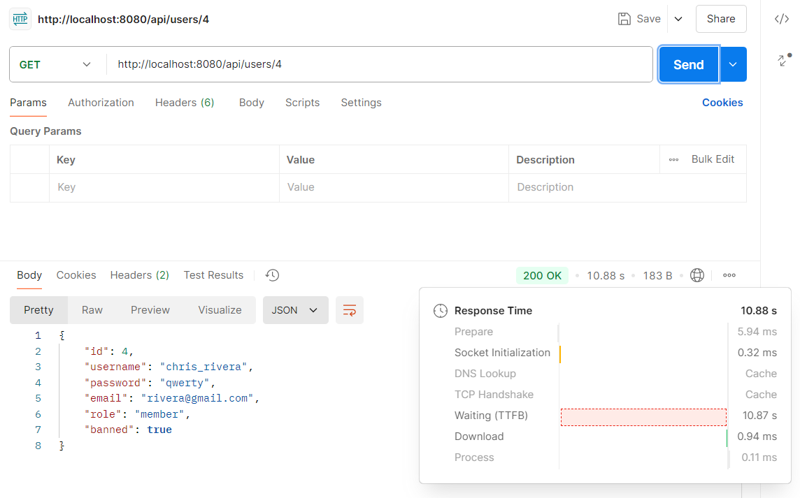
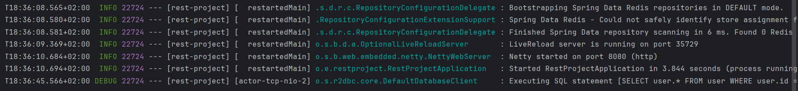
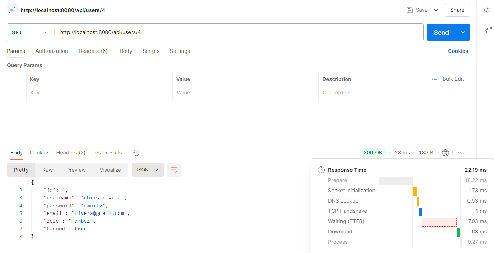
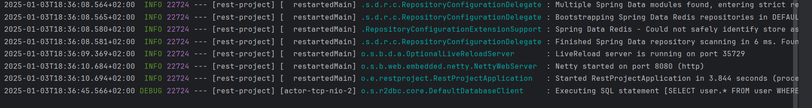
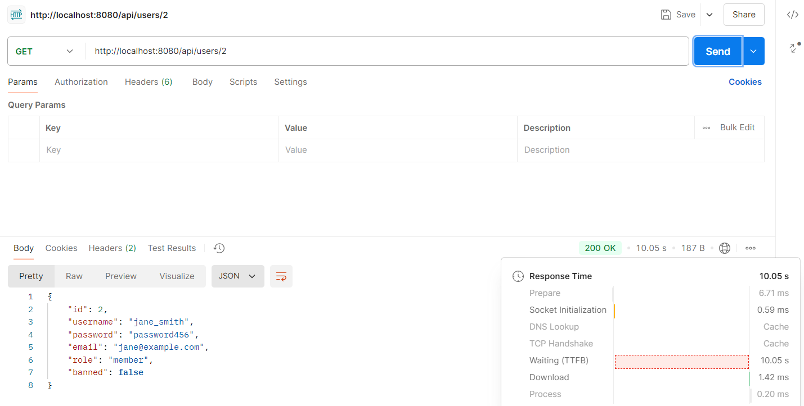
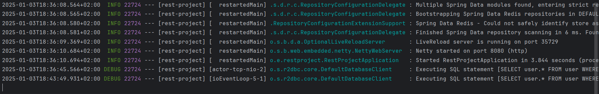
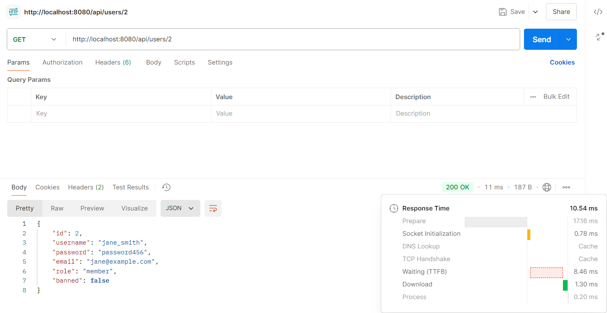
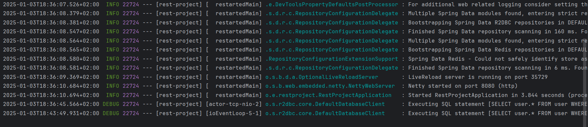

# Доповідь на тему "Реалізація кешування даних в базах даних"

## План
- [Вступ](#вступ)
- [Що таке кешування даних?](#що-таке-кешування-даних)
- [Переваги та недоліки кешування](#переваги-та-недоліки-кешування)
- [Архітектури кешування](#архітектури-кешування)
- [Алгоритми кешування](#алгоритми-кешування)
- [Методи інтеграції кешу з базою даних](#методи-інтеграції-кешу-з-базою-даних)
- [Приклади використання кешування в реальних системах](#приклади-використання-кешування-в-реальних-системах)
- [Проблеми та виклики кешування](#проблеми-та-виклики-кешування)
- [Рекомендації щодо використання кешування](#рекомендації-щодо-використання-кешування)
- [Висновки](#висновки)
- [Бонус: налаштування Redis у Spring Boot проєкті](#бонус-налаштування-redis-у-spring-boot-проєкті)


## Вступ

У сучасному світі обробка великих обсягів даних є ключовим викликом для інформаційних систем. 
Висока швидкість доступу до даних визначає успіх веб-додатків, мобільних сервісів та корпоративних систем. 
Уявіть собі, що користувач відкриває сторінку на сайті, і замість миттєвого завантаження контенту 
він чекає кілька секунд, поки система отримує інформацію з бази даних. Такі затримки можуть призводити 
до втрати користувачів, зниження конверсії та негативного враження. Для розв'язання цієї проблеми активно 
використовують кешування даних. Воно допомагає мінімізувати час доступу до потрібної інформації та знижує навантаження на базу даних.

Метою доповіді є пояснення принципів роботи кешування, розкриття його значення для підвищення продуктивності систем і опис способів реалізації. 
Ми також розглянемо різні типи кешу та порівняємо їх з основними сховищами даних, щоб краще зрозуміти їхні переваги та недоліки.


## Що таке кешування даних?

Кешування даних — це процес тимчасового збереження часто використовуваної інформації в швидкодоступному сховищі, 
яке називається кешем. Ключова ідея полягає в тому, що якщо дані не змінюються, їх не потрібно щоразу отримувати з 
основного джерела, наприклад, бази даних. Замість цього система зберігає результат одного запиту, і під час наступного 
звернення повертає ці дані без зайвих обчислень.

Основна різниця між кешем та базою даних полягає в їхньому призначенні та швидкості роботи. 
База даних — це централізоване сховище даних, яке гарантує цілісність і актуальність інформації, але доступ до неї 
зазвичай займає більше часу через складну структуру та мережеву взаємодію. Кеш, своєю чергою, оптимізований для 
швидкого читання даних і не забезпечує високого рівня цілісності. Це означає, що кеш може містити застарілі дані, 
але ціна за це — надзвичайна швидкість доступу.

Кеші поділяються на кілька типів залежно від способу їхнього розташування і використання. Найпоширеніший тип — кеш у пам’яті, 
де дані зберігаються в оперативній пам’яті серверів. Він забезпечує максимальну швидкість доступу і використовується, 
наприклад, у таких інструментах, як Redis чи Memcached. Файловий кеш зберігає інформацію у вигляді файлів на диску, що трохи повільніше, 
але корисно для зберігання великих обсягів даних. Розподілений кеш об’єднує кілька серверів і використовується у великих масштабованих 
системах, таких як Amazon DynamoDB Accelerator. Всі ці типи кешу мають свої особливості, але їхня спільна мета — підвищити ефективність роботи системи.

Кешування є ключовим компонентом у багатьох технологіях, від браузерів, які зберігають зображення та файли для швидшого завантаження сайтів, 
до серверних систем, що кешують запити до баз даних або API. Його ефективне використання дозволяє не тільки заощадити ресурси, а й значно 
покращити досвід користувача.


## Переваги та недоліки кешування

Кешування даних стало невід’ємною частиною сучасних інформаційних систем завдяки численним перевагам, які воно надає. Основними перевагами є зменшення затримки доступу до даних, зниження навантаження на базу даних та загальне покращення продуктивності системи.

Зменшення затримки доступу до даних є найочевиднішою перевагою кешування. Дані, збережені в кеші, знаходяться в оперативній пам’яті або ближче до кінцевого користувача. Це дозволяє значно скоротити час, необхідний для отримання інформації, адже звернення до кешу зазвичай займає мілісекунди, тоді як запит до бази даних може тривати набагато довше через складні операції пошуку, обчислень та мережевої взаємодії.

Ще однією важливою перевагою є зменшення навантаження на базу даних. Уявімо ситуацію, коли популярний вебсайт отримує сотні тисяч запитів до одного й того ж ресурсу, наприклад, сторінки каталогу товарів. Якщо кожен запит буде оброблятися безпосередньо базою даних, це може призвести до перевантаження системи, зниження її стабільності та навіть до збоїв. Використання кешу дозволяє обробляти такі запити без повторних звернень до бази, що суттєво підвищує надійність і стійкість системи до великих навантажень.

Окрім цього, кешування загалом покращує продуктивність усієї системи. Це важливо не лише для окремих запитів, а й для забезпечення стабільної роботи всього додатку. У результаті підвищується задоволеність користувачів, адже швидкість роботи вебсайту чи додатку є критично важливим фактором для утримання їхньої уваги.

Однак, разом із перевагами, кешування має й свої недоліки. До основних недоліків можна віднести можливість застарілих даних, витрати на підтримку кешу та додаткова складність реалізації.

Найбільш суттєвим з них є можливість застарілих даних. Кеш зберігає інформацію у тому стані, в якому вона була на момент збереження. Якщо дані у базі змінюються, а кеш не оновлюється належним чином, користувачі можуть отримувати застарілу інформацію. Наприклад, це може бути критично у фінансових системах або інтернет-магазинах, де точність інформації має вирішальне значення.

Ще одним недоліком є витрати на підтримку кешу. Ресурси, потрібні для зберігання та управління кешем, такі як оперативна пам'ять, сервери або програмне забезпечення, можуть бути значними, особливо у великих системах із розподіленим кешем. До того ж, системи кешування потребують налаштування та моніторингу, щоб забезпечити їхню ефективність і узгодженість з основною базою даних.

Останнім недоліком є додаткова складність реалізації. Інтеграція кешу в існуючу систему вимагає ретельного планування, щоб уникнути таких проблем, як дублювання запитів, некоректне оновлення даних чи надмірне зростання розміру кешу. Крім того, необхідно враховувати специфіку алгоритмів кешування, таких як LRU чи LFU, щоб забезпечити оптимальну роботу.

Попри ці недоліки, кешування залишається одним із найбільш ефективних способів підвищення продуктивності систем, особливо за умови грамотної реалізації та підтримки.


## Архітектури кешування

Архітектура кешування визначає, де саме зберігаються дані та як вони використовуються для оптимізації роботи системи. Вибір правильної архітектури залежить від вимог до продуктивності, масштабованості та доступності. Існує дві основні архітектури кешування: кешування на стороні клієнта та кешування на стороні сервера. Останнє може реалізовуватися в різних формах, таких як локальне, розподілене кешування та кешування через мережі доставки контенту (CDN).

### Кешування на стороні клієнта

Кешування на стороні клієнта передбачає зберігання даних безпосередньо на пристрої користувача або в браузері. Це ефективний спосіб зменшення навантаження на сервер і мережу, адже дані завантажуються лише один раз і зберігаються локально. Прикладом такого кешування є збереження зображень, CSS-файлів або JavaScript у браузері користувача.

HTTP-кешування є одним із найпоширеніших механізмів цього типу. Заголовки, такі як Cache-Control або Expires, дозволяють серверу вказувати, як довго дані можуть зберігатися на клієнтському боці. Наприклад, якщо користувач відвідує вебсайт, браузер може зберегти статичні ресурси, щоб при повторному відвідуванні сторінка завантажувалася миттєво.

Однак кешування на рівні клієнта має свої обмеження. Наприклад, якщо дані змінюються, необхідно оновлювати кеш, що може викликати труднощі, якщо клієнт використовує застарілі версії ресурсів.

### Кешування на стороні сервера

Кешування на стороні сервера включає декілька підходів, які можуть використовуватися залежно від потреб системи:

#### Локальне кешування

Локальне кешування передбачає зберігання даних у межах одного серверного процесу або машини, яка обробляє запити. Основна перевага такого підходу полягає у високій швидкості доступу, адже дані зберігаються безпосередньо в оперативній пам'яті. Наприклад, вебсервер може зберігати в локальному кеші результати часто повторюваних запитів до бази даних, як-от список популярних продуктів. Однак цей підхід має обмеження у розподілених середовищах, де кожен сервер має власний незалежний кеш.

#### Розподілене кешування

Розподілене кешування використовується у великих системах, які складаються з багатьох серверів. Дані зберігаються у спеціалізованому розподіленому кеші, доступному для всіх серверів у системі. Це забезпечує узгодженість даних і дозволяє обробляти великі обсяги запитів. Популярні інструменти, такі як Redis або Memcached, дозволяють ефективно зберігати й отримувати дані у вигляді ключ-значення. Наприклад, у розподіленій системі електронної комерції можна використовувати розподілений кеш для збереження інформації про популярні товари, щоб уникнути зайвих запитів до бази даних.

#### CDN (Content Delivery Network)

CDN використовується для кешування статичних ресурсів, таких як зображення, відео або файли, на серверах, розташованих у різних регіонах. Це дозволяє знизити затримки доступу до контенту. Наприклад, коли користувач зі США завантажує сторінку, сервер CDN у США обслуговує його запит, а не основний сервер, розташований у Європі.

Таким чином, кешування на стороні сервера є гнучким і потужним інструментом, який може бути адаптований до різних умов і потреб, забезпечуючи баланс між продуктивністю, узгодженістю даних і масштабованістю.


## Алгоритми кешування

Коли кеш досягає свого ліміту, необхідно вирішити, які дані звільнити, щоб додати нові. Цю задачу вирішують алгоритми кешування, які визначають, які елементи потрібно видалити, аби забезпечити баланс між ефективністю використання пам’яті та швидкістю доступу до даних. Давайте розглянемо найпоширеніші алгоритми кешування.

### Least Recently Used (LRU)
Алгоритм LRU (найменш нещодавно використаний) базується на ідеї, що дані, які не використовувались протягом тривалого часу, з меншою ймовірністю знадобляться найближчим часом. При заповненні кешу він видаляє елемент, який використовувався найдовше тому.
#### Як працює:
- Кожен елемент кешу має маркер часу, який оновлюється щоразу, коли дані запитуються.
- Коли кеш переповнений, видаляється елемент із найстарішим маркером часу.
#### Приклад:
Уявімо кеш із трьома слотами `{A, B, C}`. Коли надходить запит на додавання нового елементу `D`, а кеш уже повний, алгоритм видалить елемент `A`, оскільки він використовувався найдовше тому. Результат: кеш тепер містить `{B, C, D}`.
#### Переваги:
- Простий і добре підходить для систем із даними, які активно змінюються.
#### Недоліки:
- Потребує додаткових ресурсів для відстеження порядку доступу до елементів.

### Least Frequently Used (LFU)
Алгоритм LFU (найменш часто використовуваний) видаляє дані, які найрідше використовувалися за час їх перебування в кеші. Він базується на припущенні, що дані, які рідко використовуються, є менш цінними.
#### Як працює:
- Кожен елемент має лічильник, який збільшується щоразу, коли до нього звертаються.
- Коли кеш переповнюється, видаляється елемент із найменшим значенням лічильника.
#### Приклад:
Якщо в кеші є три елементи `{A (3 звернення), B (2 звернення), C (1 звернення)}`, і потрібно додати елемент `D`, алгоритм видалить `C`, адже він використовувався найрідше. Новий стан кешу: `{A, B, D}`.
#### Переваги:
- Добре працює для систем із передбачуваним шаблоном доступу до даних.
#### Недоліки:
- Може зберігати застарілі дані, якщо вони колись активно використовувались.

### First In, First Out (FIFO)
Алгоритм FIFO (перший прийшов, перший пішов) працює за принципом черги: найстаріший елемент у кеші видаляється першим, незалежно від того, як часто або нещодавно він використовувався.
#### Як працює:
- Дані додаються до кешу в порядку надходження.
- Коли кеш заповнюється, видаляється елемент, який був доданий першим.
#### Приклад:
Кеш містить `{A, B, C}`. Надходить запит на додавання елемента `D`. Алгоритм видаляє `A` (перший доданий елемент), і кеш стає `{B, C, D}`.
#### Переваги:
- Легкий у реалізації.
#### Недоліки:
- Ігнорує актуальність та частоту використання даних, що може призводити до видалення важливих елементів.

### Інші підходи
- **Random Replacement**:
  - Видаляється випадковий елемент із кешу.
  - **Переваги**: Простота реалізації.
  - **Недоліки**: Може призводити до видалення потрібних даних.
- **Adaptive Replacement Cache (ARC)**:
  - Комбінує підходи LRU та LFU, адаптуючись до різних шаблонів доступу.
  - **Переваги**: Забезпечує баланс між частотою та часом доступу до даних.
  - **Недоліки**: Складна реалізація.
- **Time-to-Live (TTL)**:
  - Кожен елемент має обмежений час існування в кеші. Після завершення цього часу дані автоматично видаляються.
  - **Переваги**: Простий спосіб уникнути застарілих даних.
  - **Недоліки**: Може видалити актуальні дані, якщо їх не запитували вчасно.

Алгоритми кешування підбираються залежно від особливостей системи. LRU підходить для сценаріїв із частими змінами даних, LFU — для систем зі стабільним шаблоном доступу, а FIFO — для лінійних операцій. Інші підходи, як-от ARC або TTL, дають більше гнучкості, але потребують додаткових ресурсів. У кожному випадку вибір алгоритму залежить від потреб конкретного додатка та його вимог до продуктивності.


## Методи інтеграції кешу з базою даних

Ефективна інтеграція кешу з базою даних є ключовим фактором для підвищення продуктивності сучасних систем. Залежно від потреб, масштабу додатка та вимог до доступності даних, використовуються різні підходи до інтеграції кешу. Вони варіюються від використання зовнішніх інструментів до впровадження вбудованих механізмів і побудови проміжних шарів.

### Використання окремих інструментів (Memcached, Redis)
Один із найпоширеніших методів кешування передбачає використання спеціалізованих інструментів, таких як Memcached чи Redis, які зберігають дані в оперативній пам’яті. Ці системи забезпечують миттєвий доступ до даних, оскільки обходять дискові операції, характерні для традиційних баз даних.
#### Як це працює:
1. При надходженні запиту система спочатку перевіряє, чи є потрібні дані в кеші.
2. Якщо дані є — вони миттєво повертаються користувачеві.
3. Якщо даних у кеші немає, система звертається до бази даних, отримує необхідні дані та зберігає їх у кеші для майбутнього використання.
#### Приклад:
Уявімо, що ми розробляємо інтернет-магазин. Найпопулярніші товари постійно запитуються користувачами. Щоб зменшити навантаження на базу даних, їхні ціни та опис зберігаються у Redis. Кожного разу, коли користувач заходить на сторінку товару, дані беруться з кешу. Це забезпечує високу швидкість завантаження.
#### Переваги:
- Значне зменшення часу доступу до даних.
- Можливість зберігати дані в складних структурах (списки, множини тощо, як у Redis).
- Легко масштабується для великих систем.
#### Недоліки:
- Необхідно додатково налаштовувати та обслуговувати інструменти кешування.
- Дані можуть застарівати, якщо не реалізовано належного механізму оновлення або інвалідності кешу.

### Вбудовані механізми кешування (Materialized Views у PostgreSQL)
Сучасні системи управління базами даних (СУБД) часто включають вбудовані механізми кешування. Одним із таких механізмів є матеріалізовані подання (Materialized Views) у PostgreSQL. Це спосіб зберігати результати складних SQL-запитів у вигляді окремої таблиці, яка оновлюється вручну або автоматично.
#### Як це працює:
1. Розробник створює матеріалізоване подання на основі складного запиту.
2. Система зберігає результат цього запиту у вигляді таблиці.
3. При запиті користувач отримує дані без повторного виконання вихідного запиту.
#### Приклад:
Припустимо, у нас є аналітична система, яка обчислює щоденні продажі товарів. Замість повторного виконання складного запиту до бази, ми створюємо матеріалізоване подання, яке оновлюється раз на добу. Під час запитів користувачі отримують вже підготовлені результати, що суттєво знижує навантаження на базу.
#### Переваги:
- Спрощення структури запитів, адже результат уже зберігається у готовому вигляді.
- Зменшення часу виконання складних запитів.
#### Недоліки:
- Оновлення матеріалізованого подання може займати багато часу.
- Не всі СУБД підтримують такі механізми.

### Проміжний шар кешування (Data Access Layer)
Проміжний шар кешування забезпечує інтеграцію кешу у вигляді окремого компонента, який розташовується між додатком і базою даних. Цей шар бере на себе всю логіку кешування: перевірку наявності даних у кеші, запис нових даних, а також синхронізацію з базою.
#### Як це працює:
1. Запит від додатка надходить до проміжного шару, а не напряму до бази.
2. Проміжний шар перевіряє кеш:
    - Якщо дані є — вони повертаються додатку.
    - Якщо даних немає — виконується запит до бази, після чого дані додаються в кеш.
#### Приклад:
Використання ORM (Object-Relational Mapping), наприклад, Hibernate, дозволяє реалізувати проміжний шар кешування. Hibernate підтримує кеш другого рівня, який зберігає результати SQL-запитів у Redis чи Memcached. Це забезпечує швидкий доступ до даних, зменшуючи кількість звернень до бази.
#### Переваги:
- Чітке розділення кешу та основної бази.
- Гнучкість у налаштуванні механізмів кешування.
#### Недоліки:
- Додаткова складність архітектури.
- Можливі проблеми з несинхронізованими даними між кешем і базою.

Кожен із розглянутих методів інтеграції кешу має свої переваги та недоліки. Використання зовнішніх інструментів, таких як Redis чи Memcached, забезпечує максимальну продуктивність і гнучкість. Вбудовані механізми, такі як Materialized Views, значно спрощують роботу з даними у межах однієї СУБД. Проміжний шар кешування є універсальним підходом, що підходить для складних систем із різними джерелами даних. Вибір методу залежить від особливостей системи, вимог до швидкості доступу та обсягу даних.


## Приклади використання кешування в реальних системах

Одним із найбільш поширених прикладів використання кешування є веб-додатки, такі як Facebook та X (колишній Twitter). У цих системах щосекунди обробляються мільйони запитів. Кешування дозволяє зберігати популярні дописи, профілі користувачів та списки друзів у швидкодоступній пам'яті. Наприклад, коли користувач відкриває свою стрічку новин у Facebook, сервер завантажує дані не безпосередньо з бази даних, а з кешу, що забезпечує миттєвий доступ до оновлень.

E-commerce платформи також активно використовують кешування для покращення роботи своїх систем. Онлайн-магазини, як-от Amazon, зберігають у кеші дані про популярні товари, історію переглядів користувачів або результати пошукових запитів. Це дає змогу значно зменшити затримки під час взаємодії з сайтом, а також забезпечити швидку реакцію на дії користувача, наприклад, під час додавання товарів до кошика або перегляду рекомендацій.

Ігрові сервіси, зокрема онлайн-ігри, теж залежать від ефективного кешування. У таких системах кешування використовується для зберігання інформації про профілі гравців, ігровий прогрес або статистику. Це дозволяє знизити затримки під час гри, забезпечуючи більш плавний ігровий процес. Наприклад, у багатокористувацьких іграх, таких як World of Warcraft, кеш допомагає оперативно завантажувати дані про гравців, які перебувають поруч у віртуальному світі.


## Проблеми та виклики кешування

Кешування даних є потужним інструментом для підвищення продуктивності системи, але воно супроводжується низкою викликів, які потрібно враховувати. Основною проблемою є когерентність даних, тобто узгодженість між кешем і базою даних. Наприклад, якщо користувач оновлює свій профіль, а кеш ще не оновився, інші користувачі можуть бачити застарілу інформацію.

Щоб забезпечити актуальність даних у кеші, часто використовують механізми з обмеженим часом життя (TTL – Time-To-Live). Вони дозволяють автоматично видаляти застарілі дані через певний період. Це допомагає уникнути тривалих перевірок синхронності, які можуть негативно впливати на продуктивність системи.

Іншим важливим аспектом є обмеженість пам’яті для кешу. Якщо кількість записів перевищує доступний обсяг, система вимушена витрачати ресурси на видалення старих даних, щоб звільнити місце для нових. Це може спричиняти затримки у роботі, особливо для великих платформ, таких як e-commerce, де обсяги даних для кешування є дуже великими, а пам’ять – обмеженим ресурсом.

Таким чином, успішне кешування вимагає продуманої стратегії, яка враховує узгодженість даних, своєчасне оновлення кешу та ефективне управління пам’яттю.


## Рекомендації щодо використання кешування

Рекомендації щодо використання кешування включають кілька ключових аспектів. Перш за все, важливо обрати відповідний тип кешу для вирішення конкретної задачі. Наприклад, для зберігання тимчасових даних, які часто змінюються, краще використовувати кеш із коротким часом життя. У випадках, коли дані не змінюються протягом тривалого часу, доречним буде кеш із більш тривалим зберіганням.

Баланс між продуктивністю та актуальністю даних є ще одним важливим фактором. Необхідно враховувати, що занадто часте оновлення кешу може збільшити навантаження на систему, тоді як рідкісне оновлення може призводити до використання застарілих даних. Ефективним підходом є використання стратегій, таких як TTL або інвалідація кешу за подією, що дозволяє забезпечити актуальність даних без значних втрат продуктивності.

Моніторинг та оптимізація кешу є важливими етапами у підтримці його ефективності. Систематичний аналіз метрик, таких як частота кеш-хітів або обсяг використаної пам'яті, допомагає виявити вузькі місця у роботі кешу. Наприклад, якщо частота кеш-хітів є низькою, це може свідчити про неправильну конфігурацію або недостатній обсяг пам'яті, виділений для кешу.


## Висновки

Кешування має значні переваги, зокрема підвищення продуктивності системи, зменшення затримок під час обробки запитів і оптимізацію використання серверних ресурсів. Однак для досягнення цих результатів важливо забезпечити правильну конфігурацію та регулярну підтримку кешу. Це включає врахування специфіки завдання, моніторинг ефективності кешу та своєчасне оновлення налаштувань.

Подальші дослідження у сфері кешування спрямовані на створення нових алгоритмів, які забезпечують оптимальний баланс між швидкістю роботи та актуальністю даних. Також інтеграція з технологіями машинного навчання відкриває перспективи для адаптивного управління кешем, базованого на аналізі поведінки користувачів, що дозволяє ще більше підвищити ефективність системи.


## Бонус: налаштування Redis у Spring Boot проєкті

### 1. Потрібно завантажити Docker Desktop, якщо ви використовуєте Windows.
Якщо в вас Linux, ви можете завантажити Redis напряму через менеджер пакетів `apt`.
```
sudo apt update
sudo apt install redis-server
```

### 2. Запускаємо Docker Desktop

### 3. Відкриваємо PowerShell або командний рядок

### 4. Вводимо наступну команду
```
docker run --name redis -p 6379:6379 -d redis
```
Щоб впевнетись, що Redis був запущений, введіть:
```
docker ps
```

### 5. Відкриваємо наш Spring Boot проєкт, або створюємо його, якщо його нема

### 6. Додаємо наступні залежності у файл `pom.xml` (якщо ви використовуєте Maven)
```xml
<dependency>
    <groupId>org.springframework.boot</groupId>
    <artifactId>spring-boot-starter-data-redis</artifactId>
</dependency>
<dependency>
    <groupId>io.lettuce</groupId>
    <artifactId>lettuce-core</artifactId>
    <version>6.5.2.RELEASE</version>
</dependency>
```

### 7. Налаштовуємо Redis у `application.properties` (або `application.yml`)
```properties
spring.data.redis.host=localhost
spring.data.redis.port=6379
spring.data.redis.password=
```

### 8. Додаємо аннотацію `@EnableCaching` до головного класу проєкту
```java
@SpringBootApplication
@EnableCaching
public class RestProjectApplication {

    public static void main(String[] args) {
        SpringApplication.run(RestProjectApplication.class, args);
    }
}
```

### 9. Додаємо інтерфейс-маркер `Serializable` до класів-сутностей
```java
@Table
@Data
public class User implements Serializable {

    @Serial
    private static final long serialVersionUID = 1L;

    @Id
    private long id;
    private String username;
    private String password;
    private String email;
    private String role;
    @Column("isBanned")
    private boolean isBanned;
}
```

### 10. Налаштовуємо сервіс, додаючи аннотації `@Cacheable` до методів, які не змінюють стан бази даних, і `@CacheEvict` - які змінюють
```java
@Service
public class UserService {

    @Autowired
    private UserRepository userRepository;

    @Cacheable(cacheNames = "users", key = "#root.methodName")
    public Flux<User> getAllUsers() {
        return userRepository.findAll();
    }

    @Cacheable(cacheNames = "users", key = "#id")
    public Mono<User> getUserById(Long id) {
        return userRepository.findById(id);
    }

    @CacheEvict(cacheNames = "users", allEntries = true)
    public Mono<User> createUser(User user) {
        return userRepository.save(user);
    }

    @CacheEvict(cacheNames = "users", allEntries = true)
    public Mono<User> updateUser(Long id, User updatedUser) {
        return userRepository.findById(id)
                .flatMap(existingUser -> {
                    existingUser.setUsername(updatedUser.getUsername());
                    existingUser.setPassword(updatedUser.getPassword());
                    existingUser.setEmail(updatedUser.getEmail());
                    existingUser.setRole(updatedUser.getRole());
                    existingUser.setBanned(updatedUser.isBanned());
                    return userRepository.save(existingUser);
                });
    }

    @CacheEvict(cacheNames = "users", allEntries = true)
    public Mono<Void> deleteUser(Long id) {
        return userRepository.deleteById(id);
    }
}
```

### 11. Для наглядності, додаємо затримку до методів сервісу
```java
@Service
public class UserService {

    private static final Duration DELAY = Duration.ofSeconds(10);

    @Autowired
    private UserRepository userRepository;

    @Cacheable(cacheNames = "users", key = "#root.methodName")
    public Flux<User> getAllUsers() {
        return userRepository.findAll()
                .delayElements(DELAY);
    }

    @Cacheable(cacheNames = "users", key = "#id")
    public Mono<User> getUserById(Long id) {
        return userRepository.findById(id)
                .delayElement(DELAY);
    }

    @CacheEvict(cacheNames = "users", allEntries = true)
    public Mono<User> createUser(User user) {
        return userRepository.save(user)
                .delayElement(DELAY);
    }

    @CacheEvict(cacheNames = "users", allEntries = true)
    public Mono<User> updateUser(Long id, User updatedUser) {
        return userRepository.findById(id)
                .flatMap(existingUser -> {
                    existingUser.setUsername(updatedUser.getUsername());
                    existingUser.setPassword(updatedUser.getPassword());
                    existingUser.setEmail(updatedUser.getEmail());
                    existingUser.setRole(updatedUser.getRole());
                    existingUser.setBanned(updatedUser.isBanned());
                    return userRepository.save(existingUser);
                })
                .delayElement(DELAY);
    }

    @CacheEvict(cacheNames = "users", allEntries = true)
    public Mono<Void> deleteUser(Long id) {
        return userRepository.deleteById(id)
                .delayElement(DELAY);
    }
}
```

### 12. Тестування кешування

Відправляємо запит на отримання User з id=4. Бачимо, що час очікування надто великий (через нашу встановлену затримку), а саме Waiting


Бачимо, що в консолі залоговано, що застосунок виконав SQL запит


Відправляємо повторний запит на отримання User з id=4. Тепер відповідь ми отримали моментально, бо вона закешована


В консолі бачимо, що застосунок не виконував жодних SQL запитів


Тепер отримаємо User з id=2. Результат ананалогічний



І повторний запит

